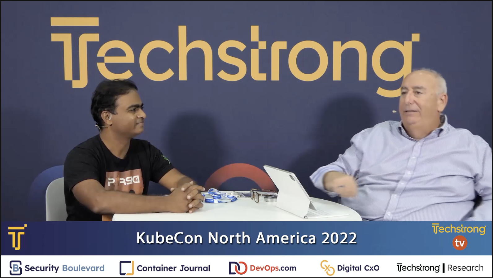
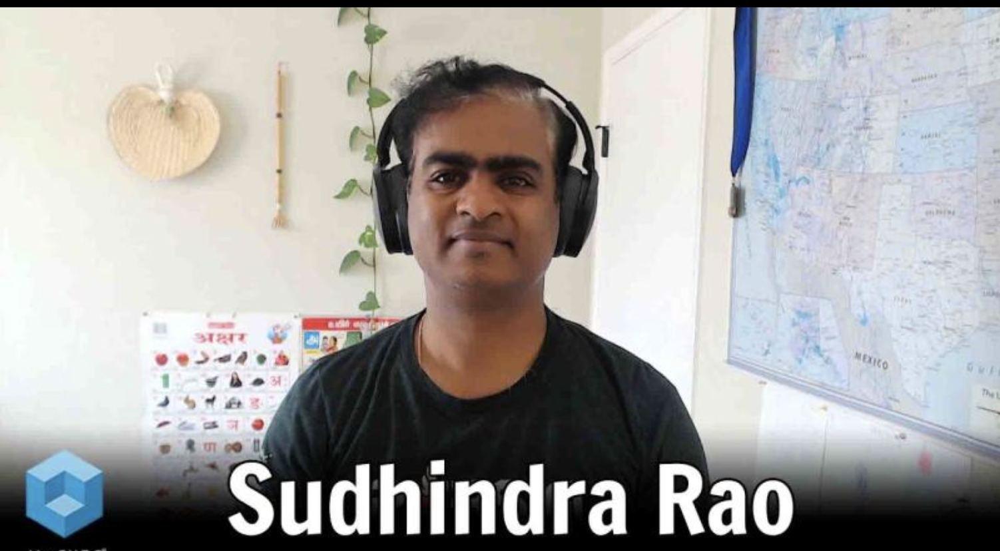
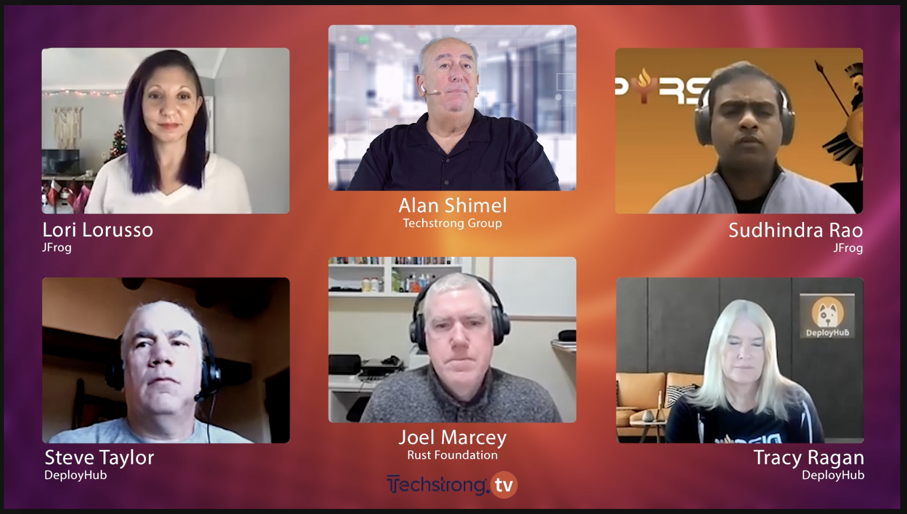

### Podcasts
* [Mingle, 10000 tests and CD pipeline](https://topenddevs.com/podcasts/ruby-rogues/episodes/194-rr-real-life-jruby-with-sudhindra-r-rao)
* [My Ruby Story](https://topenddevs.com/podcasts/my-ruby-story/episodes/mrs-029-sudhindra-rao)

### Interviews

* TechStrongTV Pyrsia Interview at KubeCon Detroit 2022
  
  

* TheCube Interview DockerCon 2022
  
  

* TechStrongTV Interview December 2022

  

### Guest Publications

* [Automate your Deployments with EbDeployer](http://www.thoughtworks.com/insights/blog/ebdeployer-automate-your-deployments-aws-elastic-beanstalk)
* [How we moved to the cloud](http://www.thoughtworks.com/insights/blog/how-we-moved-cloud)
* [How Mingle built its ElasticSearch cluster on AWS](http://www.thoughtworks.com/mingle/news/scaling/2015/01/06/How-Mingle-Built-ElasticSearch-Cluster.html)

If you would like me to appear in your publication or your podcast please email me at sudhindra(dot)r(dot)rao(at)gmail.