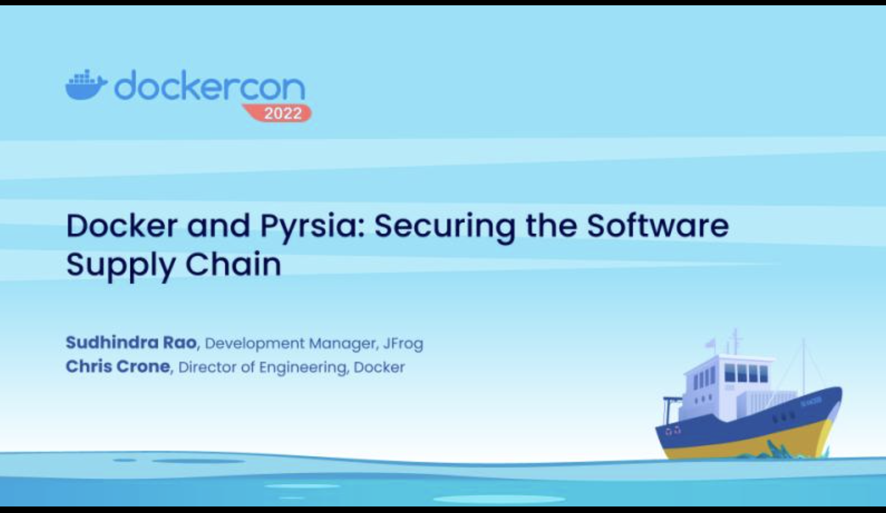
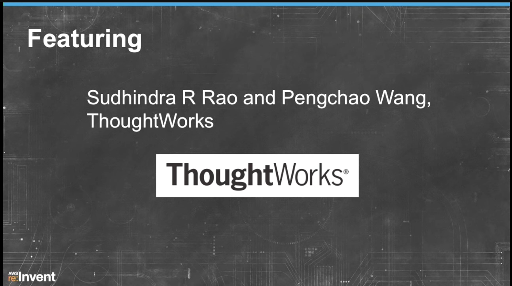
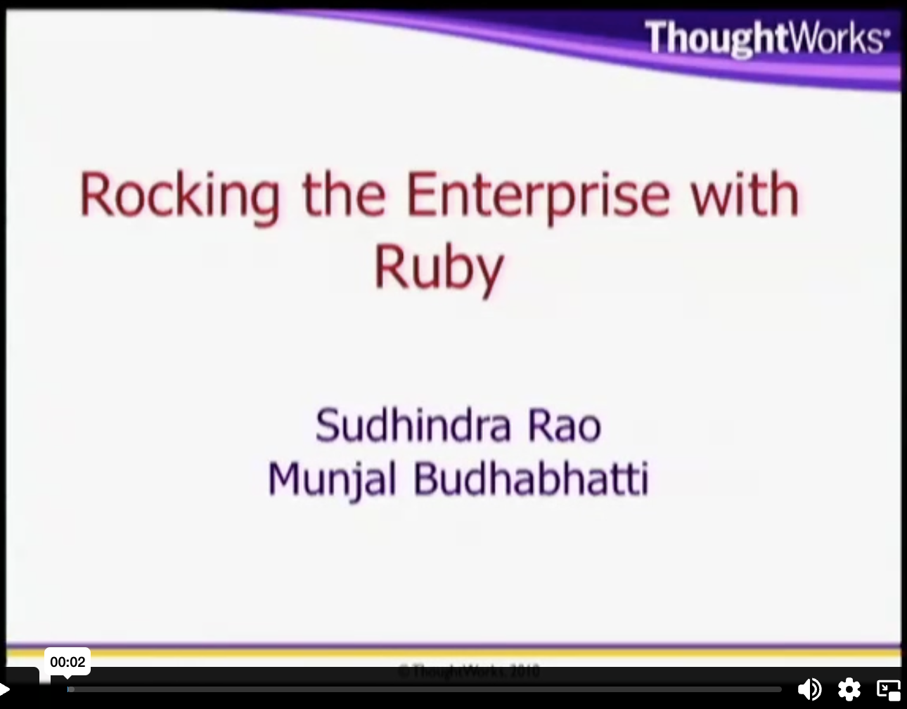

I like speaking at conferences and sharing my ideas and experiences. Some of my talks are:

* Docker and Pyrsia: Securing the Software Supply Chain
  

* Automate your deployments with EbDeployer
  

* Rocking the Enterprise with Ruby - RubyKaigi 2010
    

* [aws re:invent 2013](http://www.confreaks.com/videos/4469-awsrei2013-aws-elastic-beanstalk-under-the-hood-dmg301) - EbDeployer - [Slides](http://www.slideshare.net/AmazonWebServices/aws-elastic-beanstalk-under-the-hood-dmg301-aws-reinvent-2013-28428616)
* [Agile and Beyond 2012](http://agileandbeyond.org) - Build Feedback - [Slides](http://betarelease.github.io/build_feedback/slides.html)
* [Agile Eastern Europe 2010](http://agileee.org) - Making Feedback Visible - [Slides](http://www.slideshare.net/releasebeta/making-feedback-visible)
* [RubyKaigi 2010](http://rubykaigi.org) - Rocking the Enterprise with Ruby - [Slides](http://www.slideshare.net/releasebeta/rocking-the-enterprise-with-ruby-rubykaigi-2010)
* [Agile 2009](http://agileconf.com) - Mock Objects in Action [Slides](http://www.slideshare.net/releasebeta/mock-objectsinaction-paulocaroliandsudhindraraoagile2009final)

If you enjoy watching/listening to them, please leave me a comment.
